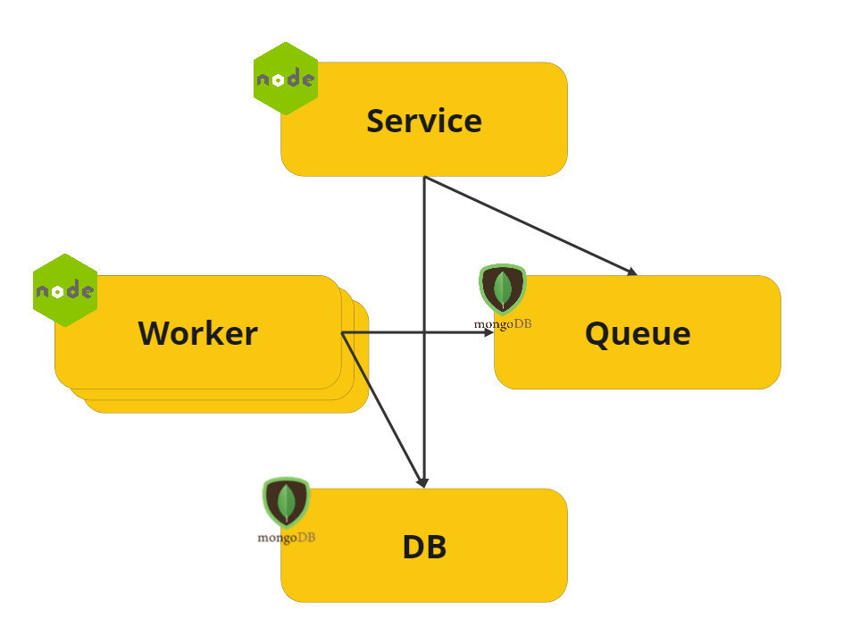

# OpenAPI QOS - Schema Quality Control for OpenAPI Services

This is a service application that helps you keep track of the quality of incoming data payloads based on your OpenAPI specifications.

The general idea is that unencrypted information from requests can be sent to this service for quality checking. Payloads are structurally validated against their schemas and individual logs are stored. Reports can be created to aggregate data by checked schema.


## Motivation
In ecosystems where the same API specification is implemented and provided by several players, such as in Open Banking, small implementation differences can create difficulties for custumers to identify problems from their providers.

This service allows consumers to analyze their suppliers' payloads against API specifications. It can also be used by suppliers to monitor the quality of what they provide.

## Getting started

Download [Docker Desktop](https://www.docker.com/products/docker-desktop) for Mac or Windows. [Docker Compose](https://docs.docker.com/compose) will be automatically installed. On Linux, make sure you have the latest version of [Compose](https://docs.docker.com/compose/install/).

This solution uses Node.js and MongoDB for storage and queue service.

Run in this directory to build and run the app:

```shell
cd compose
docker compose up
``` 

The `OpenAPI QOS` service will be running at [http://localhost:6868](http://localhost:6868), and the API documentation will be at [http://localhost:6868/docs/documentation.html](http://localhost:6868/docs/documentation.html).

## Examples

```Posting an empty payload
curl --request POST \
  --url http://localhost:8080/api/payloads \
  --header 'Accept: application/json' \
  --header 'Content-Type: application/json' \
  --header 'x-api-key: 3161fd56-1869-42d5-b58a-6c217083c739' \
  --data '{
  "oasUrl": "https://openbanking-brasil.github.io/openapi/swagger-apis/customers/2.0.1.yml",
  "payloadSourceId": "11.222.333",
  "requestUrl": "https://api.banco.com.br/open-banking/customers/v2/personal/identifications",
  "requestPath": "/personal/identifications",
  "requestOperation": "GET",
  "requestContentType": "application/json",
  "responseCode": "200",
  "responsePayload": {"obj": 123},
  "tags": "interactionId:a342d532d2343",
  "date": "2023-07-01"
}'
``` 

## Important information

All schemas referenced in OpenAPI specifications may be converted to newer versions of JSON Schema, before structural checking.


## Security 

Some configurations have been made to minimize the storage of sensitive data:
  - SAVE_PAYLOAD_CONTENT = FALSE - Sent payload is not persisted.
  - AJV_ALL_ERRORS = FALSE - Only one error example per attribute and per error type will be saved.

This service has not undergone a security hardening, so we suggest that you:

 - Change default solution parameters, especially APIKEY.
 - Configure the use of HTTPS.
 - Verify container security.
 - Verify database security.
 - Monitor database size.

## Todo Ideas
 - Implement schedule for automatic report generation.
 - Set the number of days of data to be retained in the database.
 - Improve test coverage.
 - Config to force additionalProperties to true in all objects (x- extensions should be ignored). Usefull to verify if the specs are extending an api specific version.
 - Enable individual identification of sensitive fields that should never be persisted - Redact
 - Performance - automate load test.
 - Performance - evaluate the use of Redis for queue management.
 - Performance - prioritized workers by apis/schemas. 
 - Create parameter to limit when a compiled schema (ajv) can be freed after a while.
 - Enable the check of header schemas.
 - syncronous option (?)
 - Test additional business rules of a payload.
  
## Architecture



* A service developed in [Node.js](/ApiQualityControl-app) and specified in [OpenAPI](/ApiQualityControl-app/public)
* A [MongoDB](https://hub.docker.com/_/MongoDB/) database to act as a queue 
* A [MongoDB](https://hub.docker.com/_/MongoDB/) to store results
* A [Node.js](/worker/) worker which consumes payloads received and evaluate them…

## Thanks

We’d like to give special thanks to a few of the excellent packages that our project is built on top of.

* [Ajv](https://www.npmjs.com/package/ajv) package.
* [openapi-backend](https://www.npmjs.com/package/openapi-backend) package
* [openapi-parser](https://github.com/readmeio/openapi-parser) package
* [Elements](https://github.com/stoplightio/elements) by Stoplight
* [Queue-MongoDB](https://www.npmjs.com/package/@craigbuckler/queue-mongodb) by craigbuckler

Check these projects out!